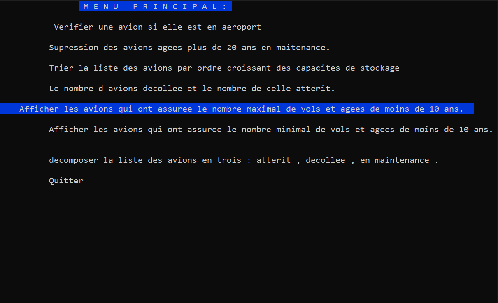

Airport Flight Management with Linked Lists
## Overview
Welcome to our Airport Flight Management project! This collaborative effort was developed during the 2022/2023 school year as part of our journey as computer science students aspiring to become skilled software engineers. Written in the C programming language, this project revolves around efficiently managing airport using simply linked lists.

